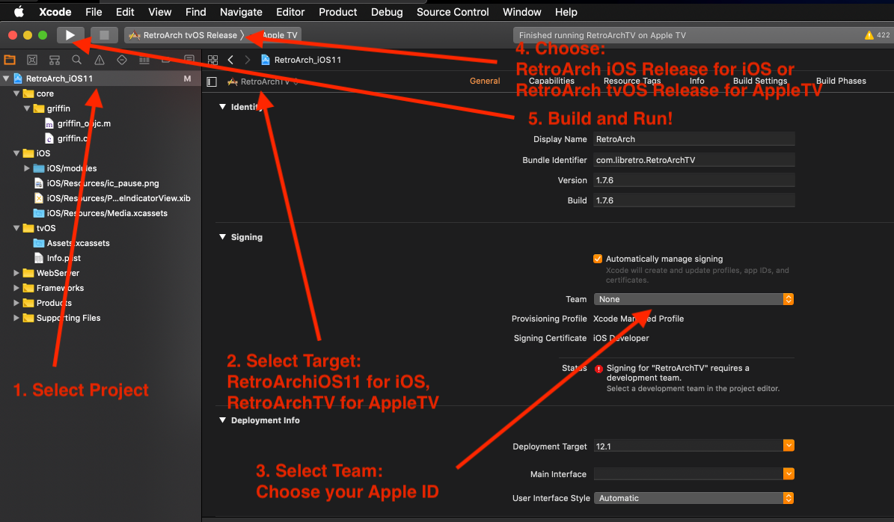

# iOS/tvOS Installation Guide

The following is a non-developer guide to install RetroArch on non-jailbroken iOS devices. We're going to try to improve the process and possibly include the iOS cores in a download, but until then, here is a way to build RetroArch to get it running on your iPhone, iPad, or Apple TV.

## Building From Source using Xcode

This is probably the most straightforward way to install RetroArch without having to resort to 3rd party tools. It does however require:

- a Mac capable of running the latest Xcode
- Xcode
- an Apple ID

### Get Xcode

Download Xcode from the Mac App Store.

### Clone the RetroArch repository

Open Terminal (it's in Applications/Utilities) and run the following command:
```
git clone https://github.com/libretro/RetroArch.git
```

### Download the Emulator Cores

Emulator cores are needed to use RetroArch as they contain the code that drives the emulation of the system of the game you want to play.

Normally you'd compile the cores, but since you're not a developer, I'll provide a link to my personal set of precompiled cores for iOS: [Download Cores from Mega.nz](https://mega.nz/#!ScRDECzC!f8Gow0Zww5kbkl4XPlCJ2lK0sFqcZ1rWSL5QYLvO0O4)

### Extract the Cores

Unzip the above archive of cores into the following directory in the RetroArch project: `pkg/apple/iOS/modules`. The core files should have the extension of `.dylib`.

### Open RetroArch in Xcode

Open the Xcode project located at `pkg/apple/iOS/RetroArch_iOS11.xcodeproj`

### Sign in with your Apple ID

- Open Xcode Preferences (Xcode -> Preferences)
- Click the "Accounts" tab
- Hit the "+" at the bottom left and choose "Apple ID" and sign in with your Apple ID
- Once you’ve successfully logged in, a new "Personal Team" with the role "Free" will appear beneath your Apple ID.

### Xcode Project Setup

You'll need to assign the Developer credentials you just created above to the RetroArch project before you can run it on your device.

Click on the project name, select the target you're interested in (RetroArchiOS11 for iOS, RetroArch TV) and change the "Team" to the role you created above.

Then choose your run target (RetroArch iOS Release for iOS, RetroArch tvOS for AppleTV) and build and run:



### Using RetroArch

On the iPhone and iPad, you'll be presented with a touch interface. If you have an mFi controller, you can control the interface that way as well.

On the Apple TV, you'll be shown the "XMB" (PS3-like) interface. You need to use an mFi controller with an Apple TV. The Siri Remote is not supported yet.

When you first start RetroArch, you'll notice that you're missing images. You'll want to run the Online Updater:

- From the main menu, choose "Online Updater"
- Choose:
  - Update Core Info Files
  - Update Assets
  - Update Databases
  - Update Overlays
  - Update GLSL Shaders

Do not choose "Core Updater"! That will not work on iOS.

#### Changing the Menu Interface

If you want more visual flair in the interface, you can change it by going to "Settings" -> "Driver" -> "Menu Driver". You might need to restart to see it take effect.
