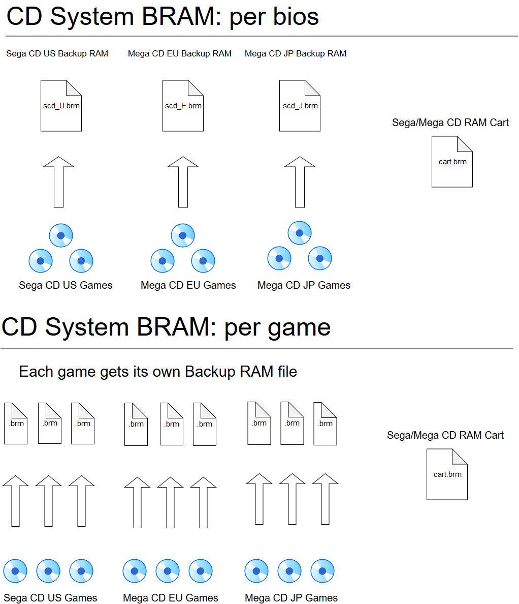
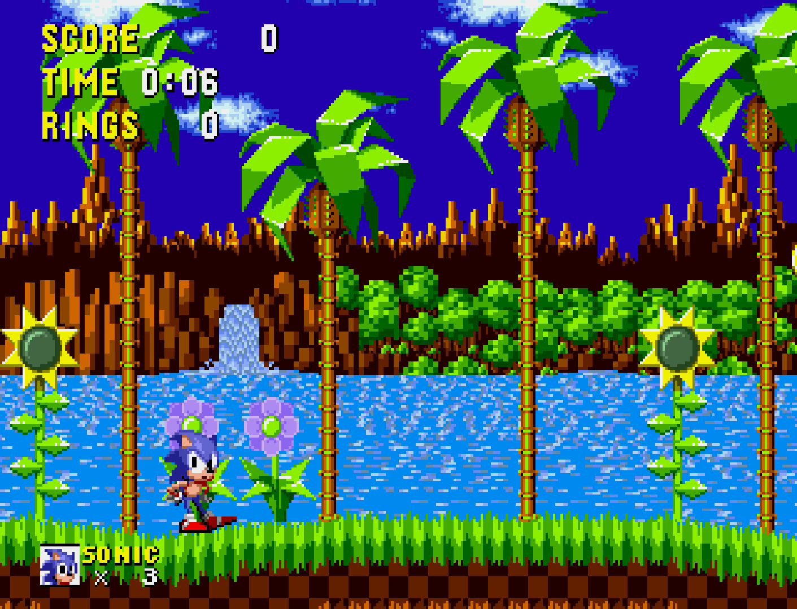
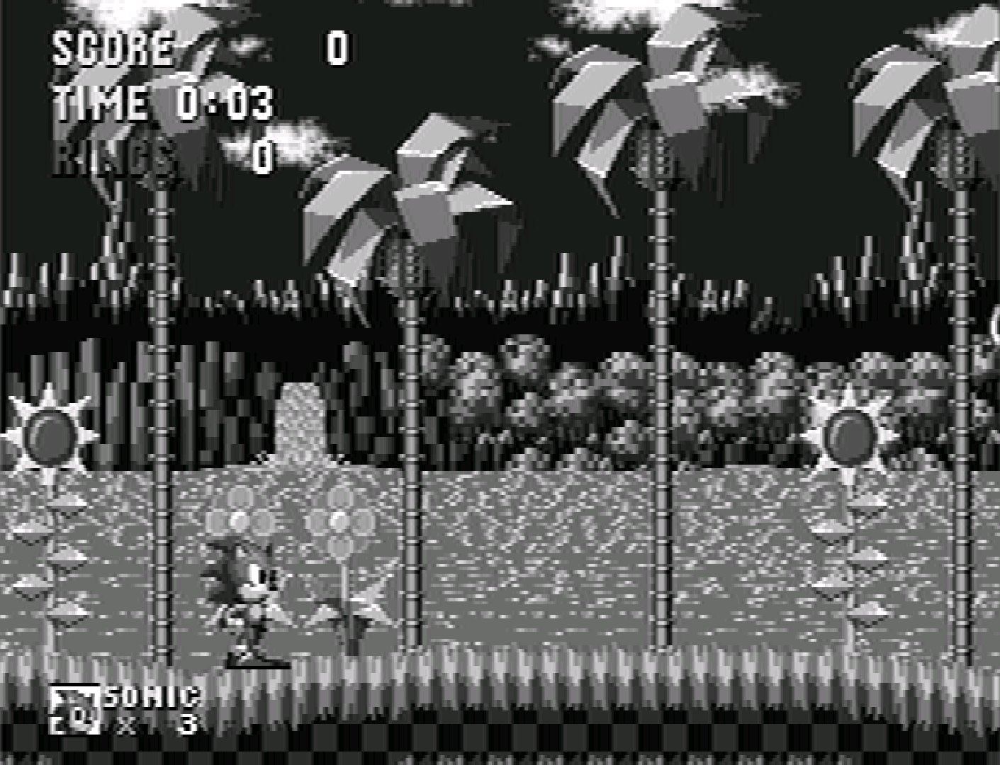
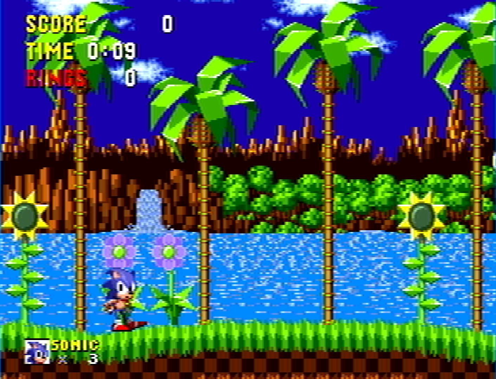
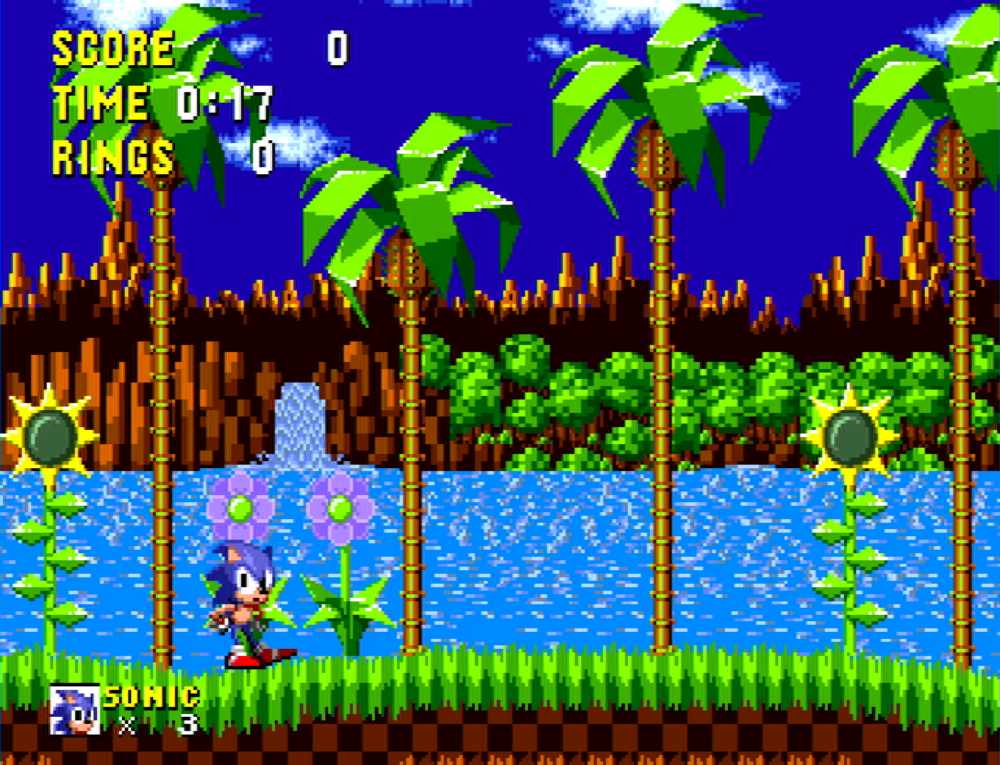
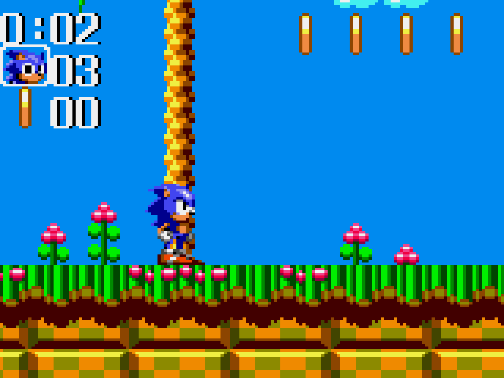
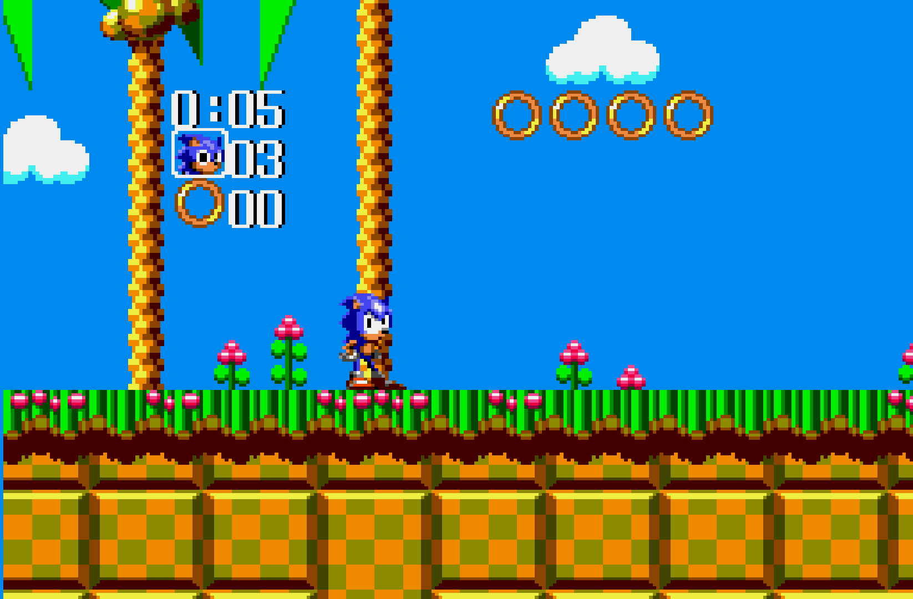

# Sega - MS/GG/MD/CD (Genesis Plus GX)

## Background

Genesis Plus GX is an open-source Sega 8/16 bit emulator focused on accuracy and portability. The source code, originally based on Genesis Plus 1.3 by Charles MacDonald, has been heavily modified & enhanced, with respect to initial goals and design, in order to improve the accuracy of emulation, implementing new features and adding support for extra peripherals, cartridge & systems hardware.

Genesis Plus GX has 100% compatibility with Genesis / Mega Drive, Sega/Mega CD, Master System, Game Gear, SG-1000 & Pico released software (including all unlicensed or pirate known dumps), also emulating backwards compatibility modes when available.

The Genesis Plus GX core has been authored by

- Charles McDonald
- Eke-Eke

The Genesis Plus GX core is licensed under

- [Non-commercial](https://github.com/libretro/Genesis-Plus-GX/blob/master/LICENSE.txt)

A summary of the licenses behind RetroArch and its cores have found [here](https://docs.libretro.com/development/licenses/).

## BIOS

Required or optional firmware files go in the frontend's system directory.

!!! warning ""
    Please note that BIOS choice isn't locked to any specific revisions.
!!! warning ""
    BIOS files that are labelled (bootrom) and (lock-on) must have their corresponding [core option](https://docs.libretro.com/library/genesis_plus_gx/#core-options) ('System bootrom' core option or 'Cartridge lock-on' core option) configured correctly in order for them to be loaded.

| Filename      | Description                                     | md5sum                           |
|:-------------:|:-----------------------------------------------:|:--------------------------------:|
| bios_MD.bin   | MegaDrive TMSS startup ROM (bootrom) - Optional | 45e298905a08f9cfb38fd504cd6dbc84 |
| bios_CD_E.bin | MegaCD EU BIOS - Required for MegaCD EU games   | e66fa1dc5820d254611fdcdba0662372 |
| bios_CD_U.bin | SegaCD US BIOS - Required for SegaCD US games   | 854b9150240a198070150e4566ae1290 |
| bios_CD_J.bin | MegaCD JP BIOS - Required for MegaCD JP games   | 278a9397d192149e84e820ac621a8edd |
| bios_E.sms    | MasterSystem EU BIOS (bootrom) - Optional       | 840481177270d5642a14ca71ee72844c |
| bios_U.sms    | MasterSystem US BIOS (bootrom) - Optional       | 840481177270d5642a14ca71ee72844c |
| bios_J.sms    | MasterSystem JP BIOS (bootrom) - Optional       | 24a519c53f67b00640d0048ef7089105 |
| bios.gg       | GameGear BIOS (bootrom) - Optional              | 672e104c3be3a238301aceffc3b23fd6 |
| sk.bin        | Sonic & Knuckles ROM (lock-on) - Optional       | 4ea493ea4e9f6c9ebfccbdb15110367e |
| sk2chip.bin   | Sonic & Knuckles UPMEM ROM (lock-on) - Optional | b4e76e416b887f4e7413ba76fa735f16 |
| areplay.bin   | Action Replay ROM (lock-on) - Optional          | a0028b3043f9d59ceeb03da5b073b30d |
| ggenie.bin    | Game Genie ROM (lock-on) - Optional             | e8af7fe115a75c849f6aab3701e7799b |

## Extensions

Content that can be loaded by the Genesis Plus GX core have the following file extensions:

- .mdx
- .md
- .smd
- .gen
- .bin
- .cue
- .iso
- .sms
- .gg
- .sg
- .68k
- .chd

RetroArch database(s) that are associated with the Genesis Plus GX core:

- [Sega - Game Gear](https://github.com/libretro/libretro-database/blob/master/rdb/Sega%20-%20Game%20Gear.rdb)
- [Sega - Master System - Mark III](https://github.com/libretro/libretro-database/blob/master/rdb/Sega%20-%20Master%20System%20-%20Mark%20III.rdb)
- [Sega - Mega-CD - Sega CD](https://github.com/libretro/libretro-database/blob/master/rdb/Sega%20-%20Mega-CD%20-%20Sega%20CD.rdb)
- [Sega - Mega Drive - Genesis](https://github.com/libretro/libretro-database/blob/master/rdb/Sega%20-%20Mega%20Drive%20-%20Genesis.rdb)
- [Sega - PICO](https://github.com/libretro/libretro-database/blob/master/rdb/Sega%20-%20PICO.rdb)
- [Sega - SG-1000](https://github.com/libretro/libretro-database/blob/master/rdb/Sega%20-%20SG-1000.rdb)

## Features

Frontend-level settings or features that the Genesis Plus GX core respects.

| Feature           | Supported |
|-------------------|:---------:|
| Restart           | ✔         |
| Saves             | ✔         |
| States            | ✔         |
| Rewind            | ✔         |
| Netplay           | ✔         |
| Core Options      | ✔         |
| RetroAchievements | ✔         |
| RetroArch Cheats  | ✔         |
| Native Cheats     | ✕         |
| Controls          | ✔         |
| Remapping         | ✔         |
| Multi-Mouse       | ✔         |
| Rumble            | ✕         |
| Sensors           | ✕         |
| Camera            | ✕         |
| Location          | ✕         |
| Subsystem         | ✕         |
| [Softpatching](https://docs.libretro.com/guides/softpatching/) | ✕         |
| Disk Control      | ✕         |
| Username          | ✕         |
| Language          | ✕         |
| Crop Overscan     | ✕         |
| LEDs              | ✕         |

## Directories

The Genesis Plus GX core's library name is 'Genesis Plus GX'

The Genesis Plus GX core saves/loads to/from these directories.

**Frontend's Save directory**

| File         | Description                                                                          |
|:------------:|:------------------------------------------------------------------------------------:|
| *.srm        | MS/GG/MD/Pico/SG-1000 Cartridge backup save                                          |
| cart.brm     | Sega/Mega CD RAM Cart                                                                |
| scd_U.brm    | Sega CD US Backup RAM - When the 'CD System BRAM' core option is set to per bios     |
| scd_E.brm    | Mega CD EU Backup RAM - When the 'CD System BRAM' core option is set to per bios     |
| scd_J.brm    | Mega CD JP Backup RAM - When the 'CD System BRAM' core option is set to per bios     |
| *.brm        | Sega CD/MegaCD Backup RAM - When the 'CD System BRAM' core option is set to per game |

**Frontend's State directory**

| File     | Description |
|:--------:|:-----------:|
| *.state# | State       |

## Geometry and timing

- The Genesis Plus GX core's core provided FPS is dependent on the loaded content.
- The Genesis Plus GX core's core provided sample rate is 44100 Hz
- The Genesis Plus GX core's base width is dependent on the loaded content.
- The Genesis Plus GX core's base height is dependent on the loaded content.
- The Genesis Plus GX core's max width is 720
- The Genesis Plus GX core's max height is 576
- The Genesis Plus GX core's core provided aspect ratio is dependent on the 'Core-provided aspect ratio' [core option](https://docs.libretro.com/library/genesis_plus_gx/#core-options).

## Loading Sega CD games

When loading Sega CD games, Genesis Plus GX needs a cue-sheet that points to an image file. A cue sheet, or cue file, is a metadata file which describes how the tracks of a CD or DVD are laid out.

If you have e.g. `foo.bin`, you should create a text file and save it as `foo.cue`. If the Sega CD game is single-track, the cue file contents should look like this:

```
 FILE "foo.bin" BINARY
  TRACK 01 MODE1/2352
   INDEX 01 00:00:00
```

After that, you can load the `foo.cue` file in RetroArch with the Genesis Plus GX core.

!!! warning ""
    Certain Sega CD games are multi-track, so their .cue files might be more complicated.

Here's a cue file example done with Lunar - Eternal Blue (USA)


!!! warning ""
	For Sega-CD games, ISO + WAV, BIN + CUE and ISO + OGG formats are supported; ISO + MP3 is not supported.

## Core options

The Genesis Plus GX core has the following option(s) that can be tweaked from the core options menu. The default setting is bolded.

Settings with (Restart) means that core has to be closed for the new setting to be applied on next launch.

- **System hardware** [genesis_plus_gx_system_hw] (**auto**/sg-1000/sg-1000 II/mark-III/master system/master system II/game gear/mega drive / genesis)

	Choose which system is going to be emulated.

- **System region** [genesis_plus_gx_region_detect] (**auto**/ntsc-u/pal/ntsc-j)

	Choose which region the system is from.

- **System lockups** [genesis_plus_gx_force_dtack] (**enabled**/disabled)

	Emulate system lockups that occur on real hardware.

- **System bootrom** [genesis_plus_gx_bios] (**disabled**/enabled)

	Runs bootrom if available and then starts loaded content after the boot sequence. Look above at the [BIOS section](https://docs.libretro.com/library/genesis_plus_gx/#bios) for more information.

- **CD System BRAM** [genesis_plus_gx_bram] (**per bios**/per game)

	The Sega CD's internal memory cannot hold a lot of saves. Setting this core option to per game allows each game to have its own one brm file, thus negating any lack of available space issues.

??? note "*CD System BRAM diagram*"
	

- **68k address error** [genesis_plus_gx_addr_error] (**enabled**/disabled)

	Emulate the [68k](http://segaretro.org/M68000) address error that occurs on real hardware. Set this to disabled when playing rom hacks since most emulators used to develop rom hacks don't emulate the error.

- **Cartridge lock-on** [genesis_plus_gx_lock_on] (**disabled**/game genie/action replay (pro)/sonic & knuckles)

	Select lock-on cartridge. Look above at the [BIOS section](https://docs.libretro.com/library/genesis_plus_gx/#bios) for more information.

- **Master System FM (YM2413)** [genesis_plus_gx_ym2413] (**auto**/disabled/enabled)

	Enable the Master System FM chip. (Enhanced sound output support for [SMS compatible games](http://segaretro.org/FM_Sound_Unit).

- **Mega Drive / Genesis FM** [genesis_plus_gx_ym2612] (**mame (ym2612)**/mame (asic ym3438)/mame (enhanced ym3438)/nuked (ym2612)/nuked (asic ym3438)/nuked (discrete ym3438))

	Awaiting description.

- **Sound output** [genesis_plus_gx_sound_output] (**stereo**/mono)

	Self-explanatory.

- **Audio filter** [genesis_plus_gx_audio_filter] (**disabled**/low-pass)

	Awaiting description.

- **Low-pass filter %** [genesis_plus_gx_lowpass_range] (5 to 95 in increments of 5. **60 is default**)

	Awaiting description.

- **Blargg NTSC filter** [genesis_plus_gx_blargg_ntsc_filter] (**Off**/monochrome/composite/svidio/rgb)

	Self-explanatory.

??? note "*Blargg NTSC filter - Off*"
    

??? note "*Blargg NTSC filter  - monochrome*"
    

??? note "*Blargg NTSC filter - composite*"
    

??? note "*Blargg NTSC filter  - svideo*"
    

??? note "*Blargg NTSC filter - rgb*"
    

- **LCD Ghosting filter** [genesis_plus_gx_lcd_filter] (**disabled**/enabled)

??? note "*LCD Ghosting filter - On*"
    

- **Borders** [genesis_plus_gx_overscan] (**disabled**/top/bottom/left/right/full)

	Self-explanatory.

- **Game Gear extended screen** [genesis_plus_gx_gg_extra] (**disabled**/enabled)

	Self-explanatory.

??? note "*Game Gear extended screen - Off*"
    

??? note "*Game Gear extended screen - On*"
    

- **Core-provided aspect ratio** [genesis_plus_gx_aspect_ratio] (**auto**/NTSC PAR/PAL PAR)

	Choose the Core-provided aspect ratio. RetroArch's aspect ratio must be set to Core provided in the Video settings for this to function properly.

- **Interlaced mode 2 output** [genesis_plus_gx_render] (**single field**/double field)

	Change how interlaced mode 2 output is handled. Games like Sonic 2's multiplayer mode uses Interlaced Mode 2.

??? note "*Interlaced mode 2 output - single field*"
    

??? note "*Interlaced mode 2 output - double field*"
    

- **Show Lightgun crosshair** [genesis_plus_gx_gun_cursor] (**disabled**/enabled)

	Shows lightgun crosshairs for the 'MD Menancer', 'MD Justifiers', and 'MS Light Phaser' Device Types.

??? note "*Lightgun crosshair*"
    

- **Invert Mouse Y-axis** [genesis_plus_gx_invert_mouse] (**disabled**/enabled)

	Inverts the Mouse Y-axis for the 'MD Mouse' Device Type.

- **CPU speed** [genesis_plus_gx_overclock] (**100%**/125%/150%/175%/200%)

	Overclock the emulated CPU.

- **Remove per-line sprite limit** [genesis_plus_gx_no_sprite_limit] (**disabled**/enabled)

	Reduce sprite flickering when enabled.

## User 1 device types

The Genesis Plus GX core supports the following device type(s) in the controls menu, bolded device types are the default for the specified user(s):

- Joypad Port Empty - None - No device is connected; input is disabled.
- **Joypad Auto** - Joypad - Depending on the loaded content, the core will automatically emulate a MD Joypad 3 Button controller, or a MD Joypad 6 Button controller or a MS Joypad 2 Button controller.
- [MD Joypad 3 Button](https://segaretro.org/Control_Pad_(Mega_Drive)) - Joypad
- [MD Joypad 6 Button](https://segaretro.org/Six_Button_Control_Pad_(Mega_Drive)) - Joypad
- [MS Joypad 2 Button](https://segaretro.org/Control_Pad_(Master_System)) - Joypad - Also used for Game Gear.
- [MD Joypad 3 Button + 4-WayPlay](https://segaretro.org/4_Way_Play) - Joypad - Enables multitap for 4-WayPlay games.
- [MD Joypad 6 Button + 4-WayPlay](https://segaretro.org/4_Way_Play) - Joypad - Enables multitap for 4-WayPlay games.
- [MD Joypad 3 Button + Teamplayer](https://segaretro.org/Team_Player) - Joypad - Enables multitap for Teamplayer games.
- [MD Joypad 6 Button + Teamplayer](https://segaretro.org/Team_Player) - Joypad - Enables multitap for Teamplayer games.
- MS Joypad 2 Button + Master Tap - Joypad - Enables Furrtek's Master Tap (unofficial mulitap device).
- [MS Light Phaser](https://segaretro.org/Light_Phaser) - Lightgun
- [MS Paddle Control](https://segaretro.org/Paddle_Control) - Analog
- [MS Sports Pad](https://segaretro.org/Sports_Pad) - Analog
- [MS Graphic Board](https://segaretro.org/Sega_Graphic_Board) - Pointer
- [MD XE-1AP](https://segaretro.org/XE-1_AP) - Analog
- [MD Mouse](https://segaretro.org/Sega_Mouse) - Mouse

## User 2 device types

- Joypad Port Empty - None - No device is connected; input is disabled.
- **Joypad Auto** - Joypad - Depending on the loaded content, the core will automatically emulate a MD Joypad 3 Button controller, or a MD Joypad 6 Button controller or a MS Joypad 2 Button controller.
- [MD Joypad 3 Button](https://segaretro.org/Control_Pad_(Mega_Drive)) - Joypad
- [MD Joypad 6 Button](https://segaretro.org/Six_Button_Control_Pad_(Mega_Drive)) - Joypad
- [MS Joypad 2 Button](https://segaretro.org/Control_Pad_(Master_System)) - Joypad - Also used for Game Gear.
- [MD Joypad 3 Button + 4-WayPlay](https://segaretro.org/4_Way_Play) - Joypad - Enables multitap for 4-WayPlay games.
- [MD Joypad 6 Button + 4-WayPlay](https://segaretro.org/4_Way_Play) - Joypad - Enables multitap for 4-WayPlay games.
- [MD Joypad 3 Button + Teamplayer](https://segaretro.org/Team_Player) - Joypad - Enables multitap for Teamplayer games.
- [MD Joypad 6 Button + Teamplayer](https://segaretro.org/Team_Player) - Joypad - Enables multitap for Teamplayer games.
- MS Joypad 2 Button + Master Tap - Joypad - Enables Furrtek's Master Tap (unofficial mulitap device).
- [MD Menancer](https://segaretro.org/Menacer) - Lightgun
- [MD Justifiers](https://segaretro.org/The_Justifier)  - Lightgun
- [MS Light Phaser](https://segaretro.org/Light_Phaser) - Lightgun
- [MS Paddle Control](https://segaretro.org/Paddle_Control) - Analog
- [MS Sports Pad](https://segaretro.org/Sports_Pad) - Analog
- [MS Graphic Board](https://segaretro.org/Sega_Graphic_Board) - Pointer
- [MD XE-1AP](https://segaretro.org/XE-1_AP) - Analog
- [MD Mouse](https://segaretro.org/Sega_Mouse) - Mouse

## Other devices

- PICO tablet - The Genesis Plus GX core can emulate PICO tablet inputs but this is done automatically, based off the game's crc, and cannot be manually selected as a device type.
- Terebi Oekaki tablet - The Genesis Plus GX core can emulate Terebi Oekaki table inputs but this is done automatically, based off the game's crc, and cannot be manually selected a device type.

## Multitap

Activating multitap support in compatible games can be configured by the 4-WayPlay, Teamplayer, Master Tap device types for the corresponding users.

## Joypad

| RetroPad Inputs                                | User 1 - 8 input descriptors | MD Joypad 3 Button | MD Joypad 6 Button | MS Joypad 2 Button | MS Paddle Control | MS Sports Pad | MD XE-1AP     |
|------------------------------------------------|------------------------------|--------------------|--------------------|--------------------|-------------------|---------------|---------------|
|              | B                            | B                  | B                  | 1                  | 1                 | 1             | E2            |
|              | A                            | A                  | A                  |                    |                   |               | E1            |
|         | Mode                         |                    | Mode               |                    |                   |               | Select        |
|          | Start                        | Start              | Start              | Start              | Start             | Start         | Start         |
|        | D-Pad Up                     | D-Pad Up           | D-Pad Up           | D-Pad Up           |                   |               |               |
|      | D-Pad Down                   | D-Pad Down         | D-Pad Down         | D-Pad Down         |                   |               |               |
|      | D-Pad Left                   | D-Pad Left         | D-Pad Left         | D-Pad Left         |                   |               |               |
|     | D-Pad Right                  | D-Pad Right        | D-Pad Right        | D-Pad Right        |                   |               |               |
|              | C                            | C                  | C                  | 2                  |                   | 2             |               |
|              | Y                            |                    | Y                  |                    |                   |               |               |
|             | X                            |                    | X                  |                    |                   |               | C             |
|             | Z                            |                    | Z                  |                    |                   |               | A             |
|             |                              |                    |                    |                    |                   |               | D             |
|             |                              |                    |                    |                    |                   |               | B             |
|             |                              |                    |                    |                    |                   |               |               |
|             |                              |                    |                    |                    |                   |               |               |
|  X  |                              |                    |                    |                    | Paddle            | Trackball X   | Thumb-stick X |
|  Y  |                              |                    |                    |                    |                   | Trackball Y   | Thumb-stick Y |
|  X |                              |                    |                    |                    |                   |               | Slider Y      |
|  Y |                              |                    |                    |                    |                   |               | Slider X      |

## Mouse

| RetroMouse Inputs                                     | MD Mouse        |
|-------------------------------------------------------|-----------------|
|  Mouse Cursor | MD Mouse Cursor |
|  Mouse 1       | MD Mouse Left   |
|  Mouse 2      | MD Mouse Right  |
|  Mouse 3     | MD Mouse Start  |
| Wheel Down                                            | MD Mouse Center |

## Pointer

| RetroPointer Inputs                                                                                                    | MS Graphic Board        |
|------------------------------------------------------------------------------------------------------------------------|-------------------------|
|  or  Pointer Position | MS Graphic Board Stylus |
|  Mouse 1                                                                        | MS Graphic Board Pen    |
|  Mouse 2                                                                       | MS Graphic Board Menu   |
|  Mouse 3                                                                      | MS Graphic Do           |

## Lightgun

| RetroLightgun Inputs                                   | MD Menacer           | MD Justifier           | MS Light Phaser           |
|--------------------------------------------------------|----------------------|------------------------|---------------------------|
|  Gun Crosshair | MD Menacer Crosshair | MD Justifier Crosshair | MS Light Phaser Crosshair |
| Gun Trigger                                            | MD Menacer A         | MD Justifier A         | MS Light Phaser A         |
| Gun Aux A                                              | MD Menacer B         | MD Justifer B          | MS Light Phaser B         |
| Gun Aux B                                              | MD Menacer C         | MD Justifer C          | MS Light Phaser C         |
| Gun Start                                              | MD Menacer Start     | MD Justifer Start      | MS Light Phaser Start     |

## Other

| Inputs                                                                                                                   | PICO tablet               | Terebi Oekaki tablet      |
|--------------------------------------------------------------------------------------------------------------------------|---------------------------|---------------------------|
|  or  Pointer Position | PICO tablet Stylus        | Terebi Oeka tablet Stylus |
|  Mouse 1                                                                          | PICO tablet Pen           | Terebi Oeka tablet Pen    |
|  Mouse 2                                                                         | PICO tablet Red           |                           |
|  Mouse 3                                                                        |                           | Terebo Peka tablet Start  |
| Wheel Up                                                                                                                 | PICO tablet Previous page |                           |
| Wheel Down                                                                                                               | PICO tablet Next page     |                           |
|                                                                                  | PICO tablet Up (White)    |                           |
|                                                                                | PICO tablet Down (Orange) |                           |
|                                                                                | PICO tablet Left (Purple) |                           |
|                                                                               | PICO tablet Right (Green) |                           |

## External Links

- [Official Genesis Plus GX Github Repository](https://github.com/ekeeke/Genesis-Plus-GX)
- [Official Genesis Plus GX Bitbucket Repository](https://bitbucket.org/eke/genesis-plus-gx)
- [Libretro Genesis Plus GX Core info file](https://github.com/libretro/libretro-super/blob/master/dist/info/genesis_plus_gx_libretro.info)
- [Libretro Genesis Plus GX Github Repository](https://github.com/libretro/Genesis-Plus-GX)
- [Report Libretro Genesis Plus GX Core Issues Here](https://github.com/libretro/Genesis-Plus-GX/issues)

## Sega 16-bit

- [Sega - Master System (Emux SMS)](https://docs.libretro.com/library/emux_sms/)
- [Sega - MS/MD/CD/32X (PicoDrive)](https://docs.libretro.com/library/picodrive/)
- [Sega - MS/GG/SG-1000 (Gearsystem)](https://docs.libretro.com/library/gearsystem/)
- [MSX/SVI/ColecoVision/SG-1000 (blueMSX)](https://docs.libretro.com/library/bluemsx/)
